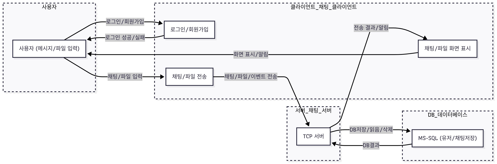

# TCP 채팅 클라이언트

## 프로젝트 개요

- WPF MVVM 기반 데스크탑 클라이언트 + .NET 콘솔 서버 + MSSQL 연동 채팅 시스템
- 실시간 채팅, 파일 전송, 회원가입/로그인, AES 대칭키 암호화 등 메신저 핵심 기능 구현
- **클라이언트**: WPF(.NET 8, MVVM), TCP 통신, 메시지/파일 암호화, 실시간 UX
- **서버**: .NET 콘솔앱, TCP 소켓 서버, DB 연동(MSSQL), 멀티 유저 처리 및 암호화 저장

---

## 아키텍처


### 전체 구조
```plaintext
TcpChatClient/
├─ Models/               # ChatMessage, ChatPacket, ClientSocket 등 채팅 데이터/네트워크
├─ Services/             # ChatService, ChatPacketHandler (비즈니스 로직/분기)
├─ Helpers/              # AesEncryption, MessageTemplateSelector 등 유틸/헬퍼
├─ Converters/           # WPF 바인딩 컨버터 (BoolToBrush 등)
├─ ViewModels/           # MainViewModel, LoginViewModel, RegisterViewModel, RelayCommand
├─ Views/                # MainWindow, LoginWindow, RegisterWindow (XAML, 코드비하인드)
├─ Resources/            # 이미지, 아이콘, 스타일
├─ App.xaml(.cs)         # 앱 진입점, 글로벌 리소스
└─ ...                   # 기타 설정/리소스
```

---
## 요구사항 및 NuGet 라이브러리

### 클라이언트
- **운영체제:** Windows 10/11
- **.NET:** .NET 8 이상
- **IDE:** Visual Studio 2022 이상
- **DB:** MSSQL Server (회원/메시지 관리)
- **NuGet 패키지:**
  - `CommunityToolkit.Mvvm` (MVVM 지원)
  - `Dapper` (ORM, DB 접근)
  - `Microsoft.Data.SqlClient`

### 서버
- **.NET:** .NET 8 이상 (Console App)
- **DB:** MSSQL Server
- **NuGet 패키지:**
  - `Dapper`
  - `Microsoft.Data.SqlClient`

---

## 주요 기능

### 클라이언트
- 회원가입 / 로그인 (MSSQL 연동)
- 실시간 채팅 (텍스트/파일/이미지)
- 메시지/파일 AES 대칭키 암호화 전송
- 파일/이미지 Drag&Drop 첨부
- 읽음/삭제/타이핑 상태 표시
- 실시간 유저 리스트, 안읽음 카운트
- 메시지/유저 검색, 날짜별 헤더, 검색어 하이라이트
- 자동 재연결(Ping/Pong, 네트워크 장애 복구)
- WPF MVVM 구조 (UI/로직 분리)

### 서버
- 멀티 유저 TCP 소켓 관리
- 회원/메시지/파일 DB 저장 및 관리
- 실시간 메시지/파일 암호화/복호화 중계
- 메시지/파일 패킷 타입별 분기 처리
- 읽음/삭제/타이핑/히스토리 등 관리
- 유저리스트, 안읽음 메시지 카운트 제공
- Heartbeat(Ping/Pong), 장애/종료 자동 관리

---

## 기술 스택

- **C#, .NET 8**
- **WPF (클라이언트 UI)**
- **TCP 소켓 통신 (비동기/스레드)**
- **MSSQL + Dapper (DB 연동)**
- **AES-128 대칭키 암호화**
- **MVVM 패턴 (CommunityToolkit.Mvvm)**
- **ConcurrentDictionary (멀티 유저 관리)**
- **JsonSerializer (패킷 직렬화/역직렬화)**

---

## 스크린샷

| 로그인 화면 | 회원가입 화면 |
|------------|----------|
|  |  |

| 전체 유저 목록 | 접속 중 유저 목록 |
|----------------|----------------|
|  |  |

| 채팅 화면 | 삭제된 메시지 표시 |
|------------|------------|
|  |  |

| 상대방 입력 중 | 메시지 검색 필터링 |
|----------------|----------------|
|  |  |


---
